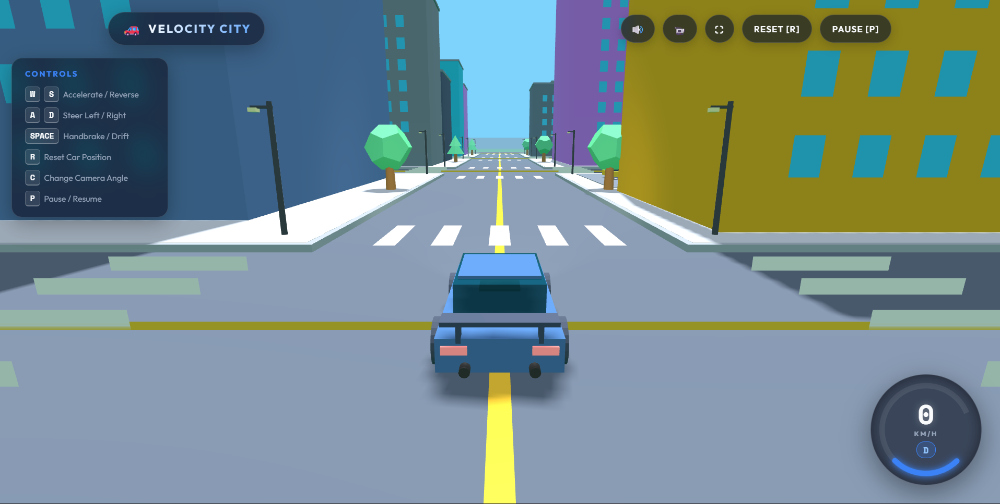
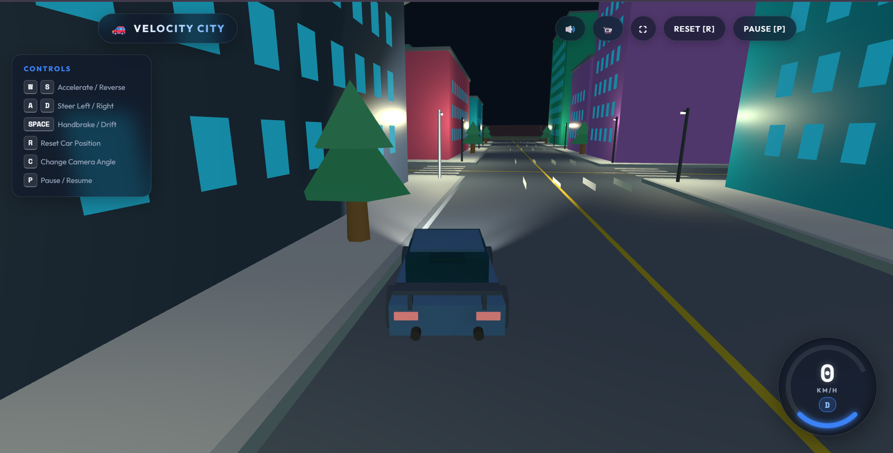
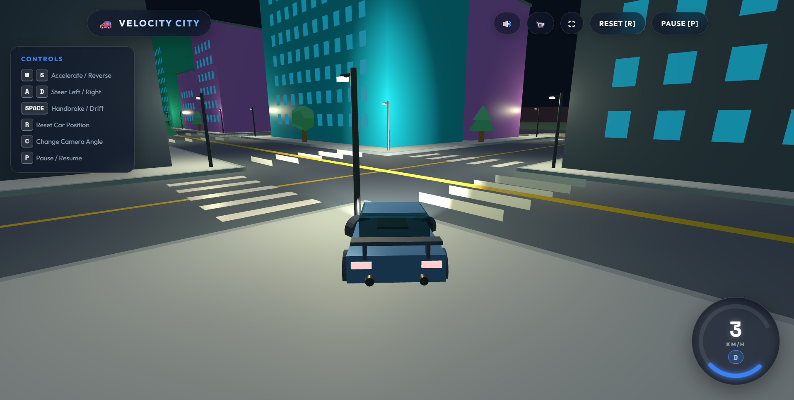

# 🏙️ Velocity City 3D - Low-Poly Driving Simulator

Velocity City 3D is a lightweight browser-based 3D driving experience built with HTML5, CSS3, JavaScript, and Three.js. No downloads or installations are required—just open the game in your browser and start driving through a modern low-poly city.

Unlike traditional racing games, Velocity City 3D focuses on the joy of free driving. Explore the city at your own pace, enjoy smooth vehicle controls, and experience a relaxing environment designed for casual gameplay. Whether you want to take a short drive or simply enjoy the scenery, the game offers a clean and enjoyable experience directly from your browser.

---

## ✨ Features

- 🚗 Smooth and responsive driving controls
- 🏙️ Stylized low-poly city environment
- 🌆 Free-roam gameplay with no missions or time limits
- 🎮 Instant browser gameplay — no installation required
- ⚡ Lightweight and optimized for fast loading
- 🎨 Clean and modern visual design
- 🕹️ Easy-to-learn keyboard controls
- 🌍 Built entirely with open web technologies

---

## 📸 Screenshots

---

## 🎮 How to Play

1. Open the game in your web browser.
2. Click **Play** to enter the city.
3. Drive freely and explore the environment.
4. Use the keyboard controls to steer, accelerate, and brake.
5. Enjoy a relaxing driving experience with no objectives or restrictions.

---

## ⌨️ Controls

| Key | Action |
|------|--------|
| ⬆️ W / ↑ | Accelerate |
| ⬇️ S / ↓ | Brake / Reverse |
| ⬅️ A / ← | Steer Left |
| ➡️ D / → | Steer Right |
| Space | Handbrake |

> **Note:** The controls listed above reflect the current gameplay. Additional controls may be added in future updates.

---

## 🛠️ Technologies Used

---

## 👨‍💻 About the Developer

**Shani Kumar** is a passionate developer who enjoys building interactive web experiences using JavaScript and modern browser technologies. Velocity City 3D showcases a simple idea brought to life with clean design, smooth gameplay, and the power of Three.js.

---

## 📄 License

This project is licensed under the **MIT License**.